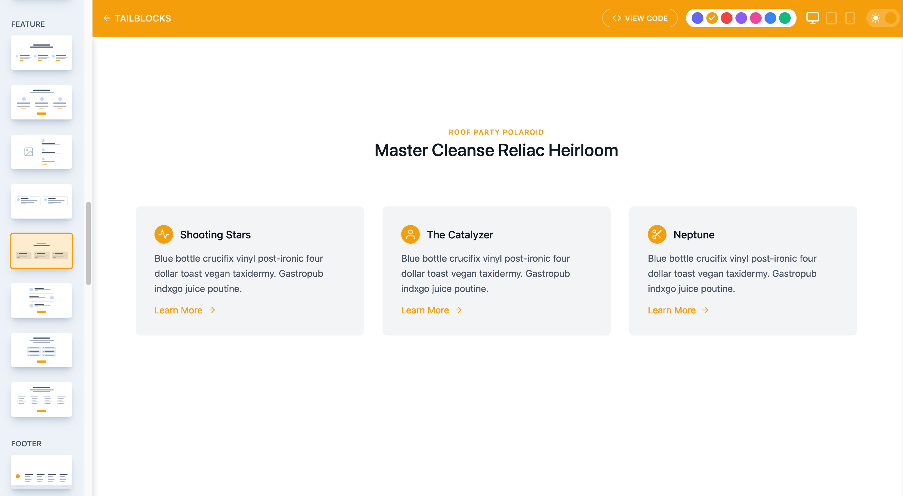

## Tailblocks

Tailblocks est simple et sans fioriture mais diablement efficace pour structurer vos blocks de code pour votre site.

On y retrouve des composants pour :

- l'affichage de vos articles de blog
- gérer votre zone de contact
- présenter votre contenu
- mettre en place des clics to actions
- initier l'affichage de votre e-commerce
- présenter les features de votre app
- gérer votre footer
- mettre en forme des galleries d'images
- gérer votre header
- générer un bloc hero pour votre site
- présenter vos tableaux de tarifs à vos clients
- montrer fièrement vos plus belles statistiques
- présenter des étapes
- présenter votre équipe 
- monter au monde entier vos témoignages de clients ou d'utilisateurs satisfaits

Comme vous pouvez le voir, Tailblocks est peut être minimaliste mais il couvre un large périmètre.

Il vous sera également possible de choisir la couleur principal de vos blocks.